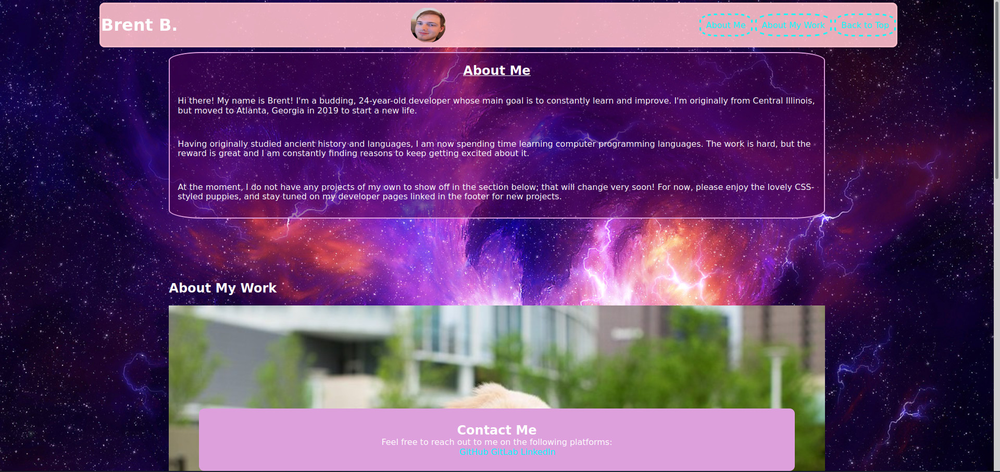

# gt-homework02 - Responsive Portfolio Assignment

## Preview

## Description

* This is a webpage meant to put my developer projects on display in a colorful way. As of right now, since I do not have any developer projects, I have used some placeholder images of cute puppies to demonstrate what links to my projects will look like. They are arranged in a grid, with the primary puppy/project being allowed the most space and its own dedicated row.

## Areas for Improvement

* This webpage does not exactly replicate the mock-up provided in the assignment's README.md, although most of the functionality is the same.

* I will be revisiting this assignment periodically to add links to new projects and to tweak particular settings. Most notably, I would like to try to get my little profile icon centered with the page again. Previously, I was able to fix this by limiting the width of each particular division of my header to 33% of the header's total width.

* In addition, I want to come back and add some hover pseudo-classes to my navigation buttons and footer links to improve responsiveness. 

* Finally, I will likely play with colors with each new iteration and establish different branches for them to give myself options for website themes. I like the colors where they're at, although I acknowledge that they may not be best practices for web/UX design.

## Deployment links
* Repo: https://github.com/BrenniusXIV/gt-homework02
* Live link: 